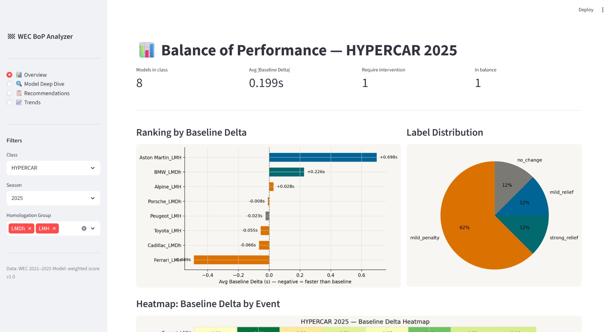
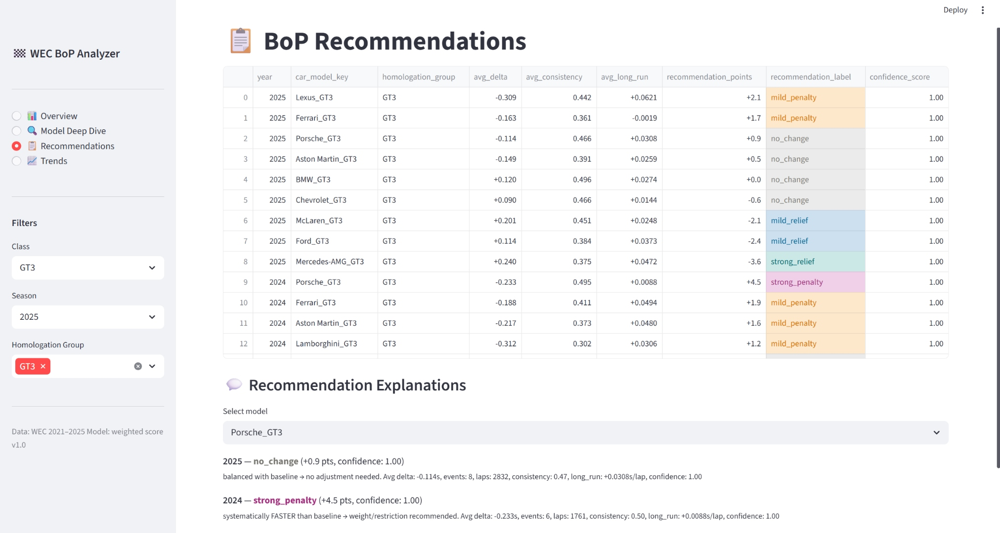
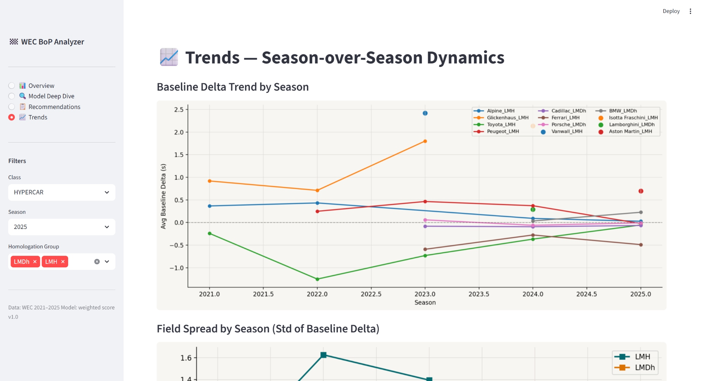
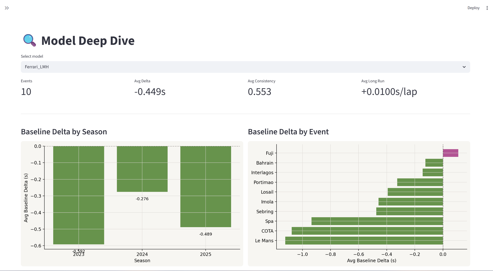

# wec-bop-analyzer

# 🏁 WEC BoP Analyzer

A data analytics project that quantifies **Balance of Performance (BoP)** effectiveness in the FIA World Endurance Championship (WEC) using lap time data from 2021–2025 seasons.

The project provides a weighted scoring model to evaluate manufacturer performance relative to class baseline, identify imbalances, and generate data-driven BoP adjustment recommendations — separately for **LMH**, **LMDh**, and **GT3** homologation groups.

---

## 📸 Screenshots

| Overview | Recommendations |
|----------|----------------|
|  |  |

| Trends | Heatmap |
|--------|---------|
|  |  |

---

## 🔍 Key Findings

### HYPERCAR
- **Toyota LMH** and **Ferrari LMH** are systematically faster than class baseline by **−0.50s** and **−0.45s** across 10–13 events — consistent over multiple seasons
- **Porsche LMDh** (−0.007s) and **Cadillac LMDh** (−0.079s) are well-balanced within the LMDh group
- **BMW LMDh** scored `strong_relief` in its debut season — consistent with expected ramp-up curve
- **Vanwall** and **Isotta Fraschini** flagged with low confidence score due to limited data (3–5 events)

### GT3 / LMGT3
- Entire field sits within **0.6 seconds** of baseline — BoP is working
- **Mercedes-AMG** (−3.6 pts) and **Ford** (−2.4 pts) are the strongest candidates for relief
- **Lexus** (+2.1 pts) and **Ferrari** (+1.7 pts) are candidates for additional restriction
- **Le Mans** is a consistent outlier for multiple GT3 manufacturers — track-specific characteristic

### Before/After Virtual BoP Validation
Applying virtual corrections (POINT_TO_SEC = 0.127) reduces field spread:
- **LMH 2024: −32% std** — strongest improvement
- **LMH 2023: −20% std**
- **GT3 2024: −19% std**
- **LMDh 2025: +8% std** — field already balanced, aggressive BoP would be counterproductive

---

## 🏗️ Architecture

```
wec-bop-analyzer/
├── data/
│   ├── raw/                    # Source parquet files
│   └── processed/
│       └── wec_bop.db          # SQLite database
├── notebooks/
│   ├── 01_data_audit.ipynb
│   ├── 02_cleaning.ipynb
│   ├── 03_feature_engineering.ipynb
│   ├── 04_balance_analyzer.ipynb
│   └── 05_bop_recommender.ipynb
├── src/
│   ├── config.py               # Parameters, weights, thresholds
│   ├── data_io.py              # Load/save helpers
│   ├── cleaning.py             # Cleaning pipeline
│   └── features.py             # Feature engineering functions
├── dashboard/
│   └── app.py                  # Streamlit dashboard
├── reports/                    # Generated charts (PNG)
└── docs/
    └── screenshots/            # Dashboard screenshots
```

---

## 🧮 Methodology

### Data Pipeline

```
raw parquet → cleaning → stint features → event model features → recommendations
```

**Cleaning filters applied:**
- Sessions: `race` only (174,955 laps)
- Lap validity: green flag laps only (no SC, VSC, pit-in/out)
- Outlier removal: IQR-based per car per session
- Minimum stint length: ≥ 3 laps for features, ≥ 8 laps for degradation

### Feature Engineering

| Feature | Description |
|---------|-------------|
| `baseline_delta` | Median clean lap time minus homologation group median per event |
| `consistency_score` | 1 − (IQR / median_lap), normalized to 0–1 |
| `long_run_score` | Linear regression slope of lap time vs tire age (s/lap) |
| `track_balance_score` | Std of baseline_delta across events in a season |
| `stint_degradation` | Per-stint degradation slope, winsorized at [p1, p99] |

### Weighted Scoring Model

Balance score computed within `[year × class × homologation_group]` groups:

```
balance_score = 0.50 × pace_norm
              + 0.20 × consistency_norm
              + 0.20 × long_run_norm
              + 0.10 × stability_norm
```

All components normalized to −1..1. Score converted to `recommendation_points` on −5..+5 scale:
- `+3..+5` → `strong_penalty` (overperforming)
- `+1..+3` → `mild_penalty`
- `−1..+1` → `no_change`
- `−3..−1` → `mild_relief`
- `−5..−3` → `strong_relief` (underperforming)

### Confidence Score

Penalizes recommendations with insufficient data:

| Condition | Multiplier |
|-----------|-----------|
| Events < MIN_EVENTS | × 0.50 |
| Events < 4 | × 0.75 |
| Clean laps < LOW_SAMPLE threshold | × 0.60 |
| Clean laps < 2× threshold | × 0.85 |
| Std delta > 1.0s | × 0.80 |

---

## 📊 Database Schema

### `stint_features`
Aggregated metrics per stint (2,570 rows)

| Column | Description |
|--------|-------------|
| `stint_degradation` | Lap time slope vs tire age (s/lap), winsorized |
| `valid_laps_count` | Clean laps used for calculation |
| `median_lap_time` | Median clean lap time in stint |

### `event_model_features`
Per-manufacturer per-event metrics (305 rows)

| Column | Description |
|--------|-------------|
| `baseline_delta` | Delta from homologation group median (s) |
| `consistency_score` | Lap time stability metric 0–1 |
| `long_run_score` | Degradation slope (s/lap) |
| `track_balance_score` | Cross-event pace stability |

### `bop_recommendations`
Season-level BoP recommendations (49 rows)

| Column | Description |
|--------|-------------|
| `balance_score` | Weighted composite score |
| `recommendation_points` | −5..+5 scale |
| `recommendation_label` | `strong_penalty` / `mild_penalty` / `no_change` / `mild_relief` / `strong_relief` |
| `confidence_score` | Data reliability weight 0–1 |
| `explanation_text` | Human-readable summary |

---

## 🚀 Quick Start

### Requirements

```bash
python >= 3.10
pandas >= 2.1
numpy
matplotlib
seaborn
streamlit
sqlite3
scikit-learn
pyarrow
```

### Installation

```bash
git clone https://github.com/your-username/wec-bop-analyzer.git
cd wec-bop-analyzer
python -m venv .venv
source .venv/bin/activate  # Windows: .venv\Scripts\activate
pip install -r requirements.txt
```

### Run the pipeline

```bash
# 1. Data audit
jupyter notebook notebooks/01_data_audit.ipynb

# 2. Cleaning
jupyter notebook notebooks/02_cleaning.ipynb

# 3. Feature engineering
jupyter notebook notebooks/03_feature_engineering.ipynb

# 4. Balance analysis
jupyter notebook notebooks/04_balance_analyzer.ipynb

# 5. BoP recommendations
jupyter notebook notebooks/05_bop_recommender.ipynb
```

### Launch dashboard

```bash
cd dashboard
streamlit run app.py
```

---

## 📈 Dashboard Pages

| Page | Description |
|------|-------------|
| **📊 Overview** | KPI metrics, ranking chart, label distribution pie, heatmap by event |
| **🔍 Model Deep Dive** | Per-model delta by season and event, stint degradation histogram |
| **📋 Recommendations** | Color-coded table with all recommendations + explanation text per model |
| **📈 Trends** | Season-over-season delta trends, field spread (std) evolution |

**Sidebar filters:** Class (HYPERCAR / GT3), Season, Homologation Group

---

## ⚠️ Limitations & Known Issues

- `POINT_TO_SEC = 0.127` is empirically derived — needs calibration against real ACO/FIA historical BoP changes
- Bahrain 6H / 8H counted as separate events from Bahrain (TODO: normalize in v2)
- GT3 data covers only 2 seasons (2024–2025) — limits cross-season stability analysis
- Wet weather analysis limited due to low sample of wet events in dataset
- Models with < 5 events (Isotta Fraschini, Vanwall) receive low confidence score — interpret with caution

---

## 🗺️ Roadmap

- [ ] **v2:** Normalize Bahrain event variants via `EVENT_NORMALIZATION`
- [ ] **v2:** Calibrate `POINT_TO_SEC` against historical BoP decisions
- [ ] **v2:** Add IMSA WeatherTech data for cross-series comparison
- [ ] **v2:** Incorporate track characteristics (downforce level, altitude, surface)
- [ ] **v3:** Time-series model for in-season BoP drift detection

---

## 🛠️ Tech Stack

| Tool | Usage |
|------|-------|
| Python 3.12 | Core language |
| pandas / numpy | Data processing |
| matplotlib / seaborn | Visualizations |
| SQLite | Data warehouse |
| Streamlit | Interactive dashboard |
| Jupyter Notebooks | Exploratory analysis |
| Git / GitHub | Version control |

---

*Pet project · Data Analytics Portfolio · WEC 2021–2025*
